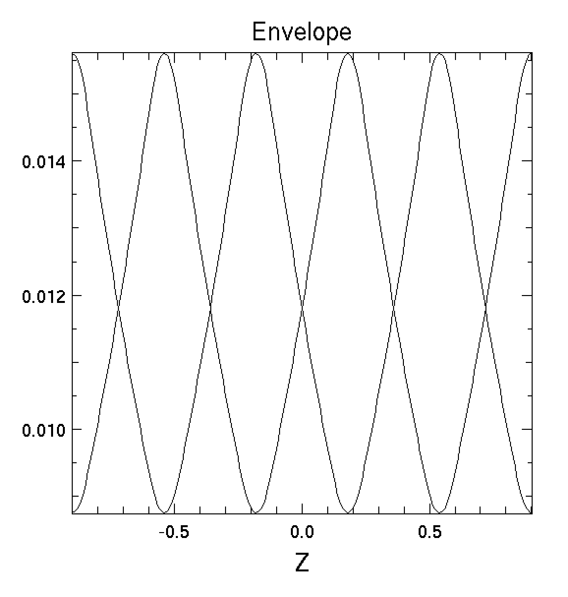

Description:

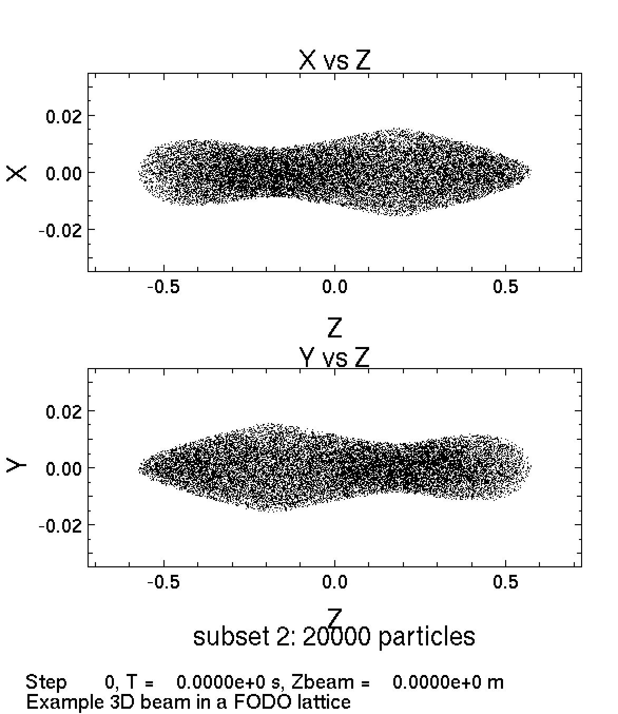

Description: Phase space plots of the spatial locations of 20,000 particles in the x axis vs z axis (top) and the y axis vs z axis (bottom). This is the plot of the initial conditions (time=0).

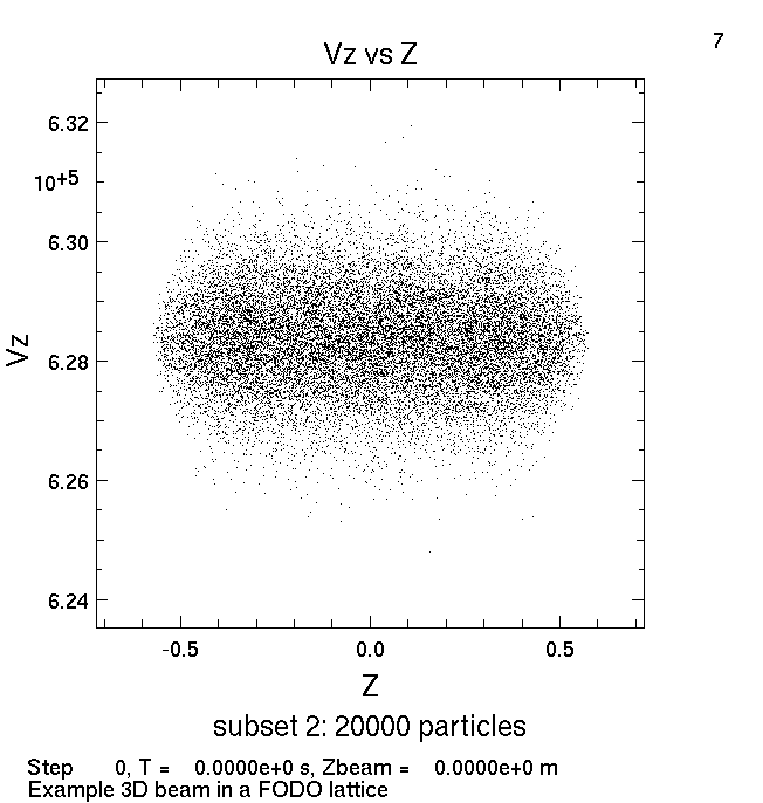

Description: Phase space plot of 20,000 particles with their velocity in the z direction plotted against their position in the z direction. This is the plot of the initial conditions (time=0).

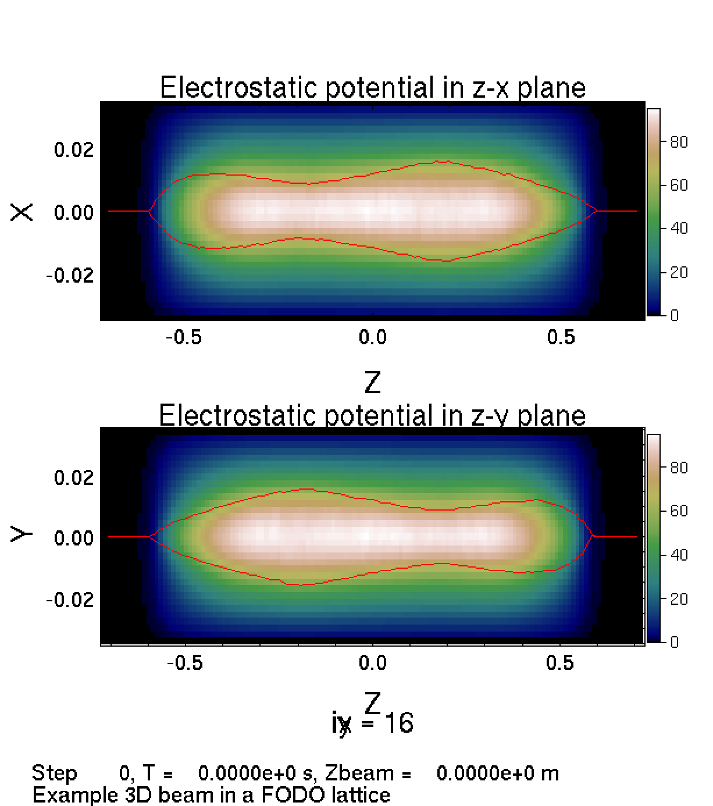

Description: Electrostatic potential of the 20,000 simulated particles in the z-x plane (top) and in the z-y plane (bottom). The electrostatic potential has units of volts.

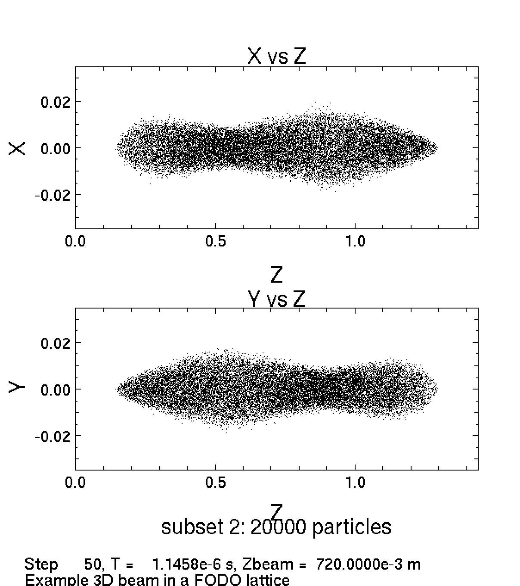

Description: This is the same as the second plot only after the program has run for 50 steps and some time has elapsed.

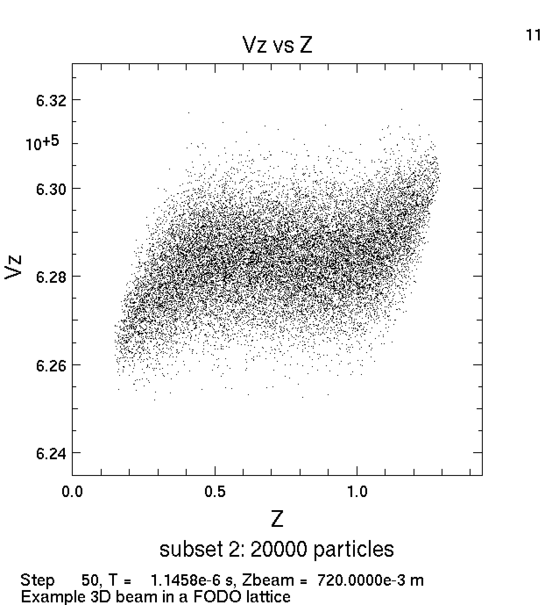

Description: This is the same as the same as the third plot in this document after the program has run for 50 steps and some time has elapsed.

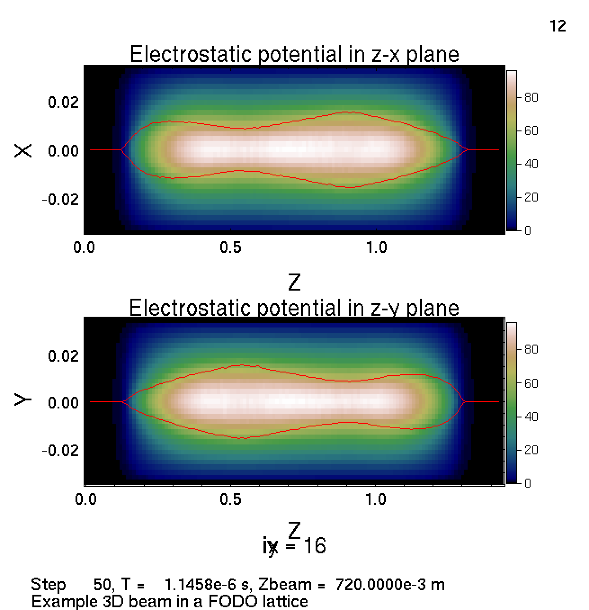

Description: This is the same as the same as the fourth plot in this document after the program has run for 50 steps and some time has elapsed.

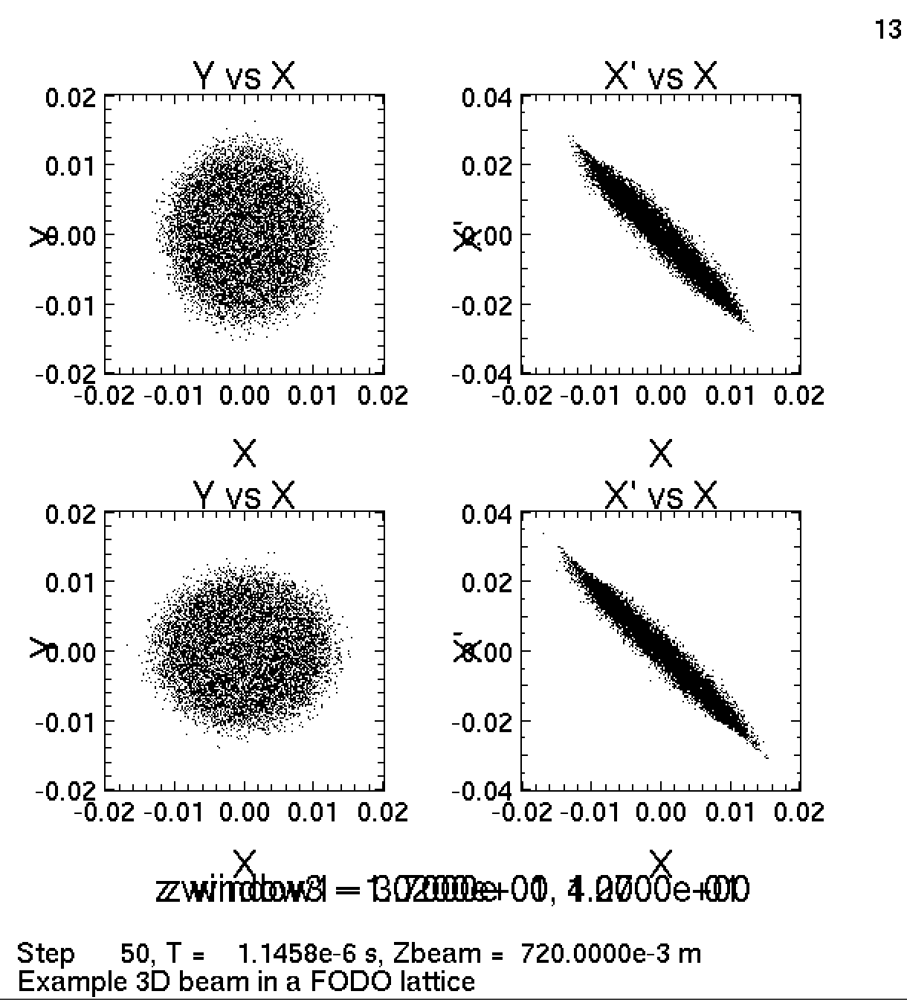

Description:

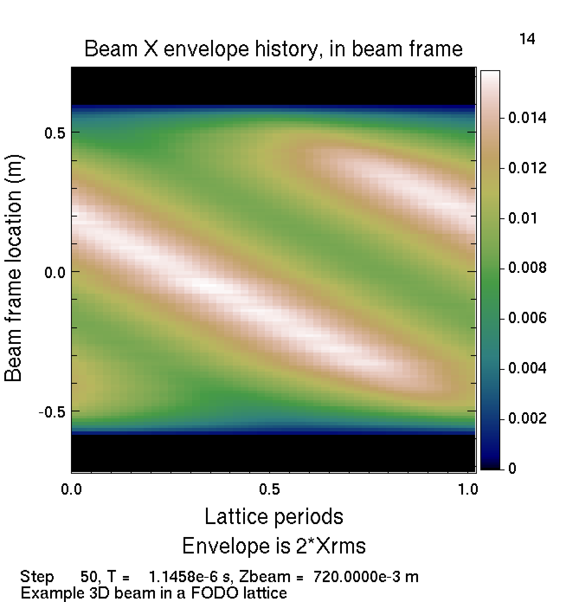

Description:

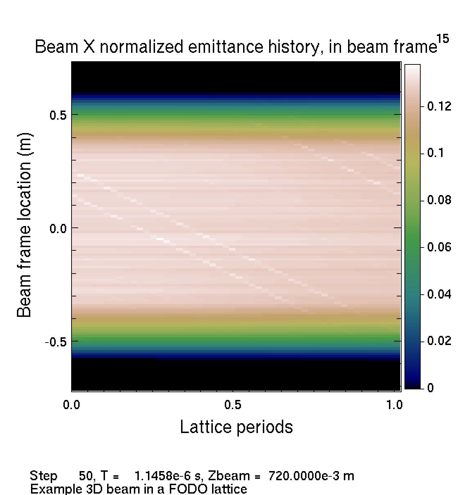

Description:

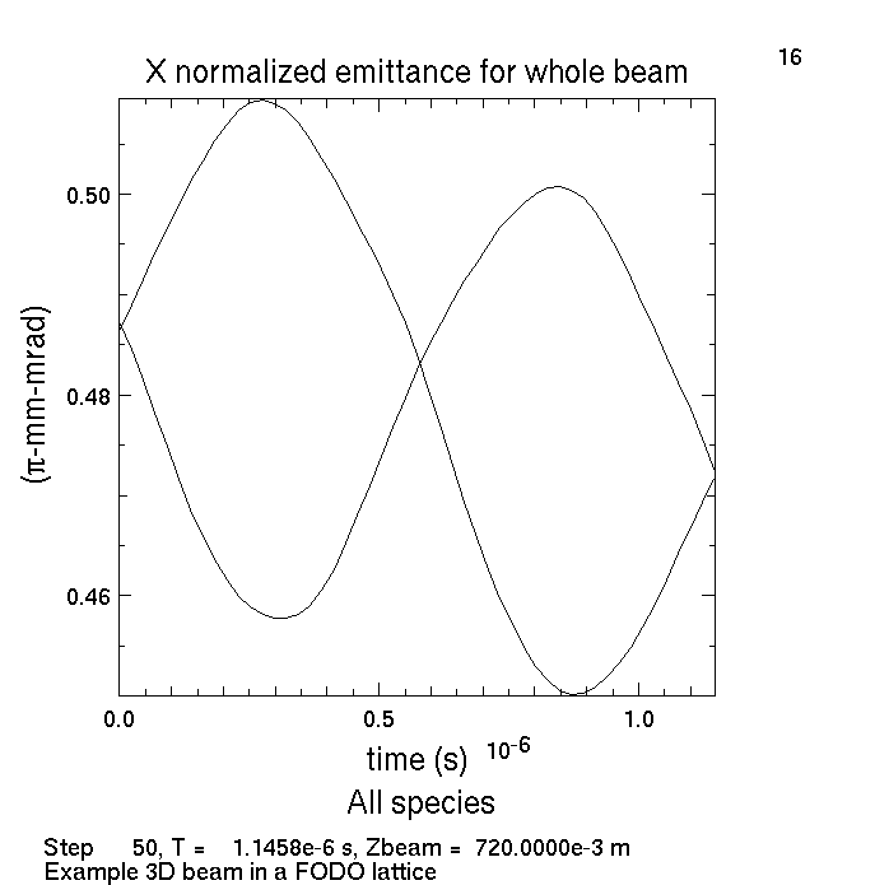

Description: Normalized emittance in the x direction for the particle beam plotted over time. Emittance is a measurement of the average spread of particle spatial and momentum coordinates.
