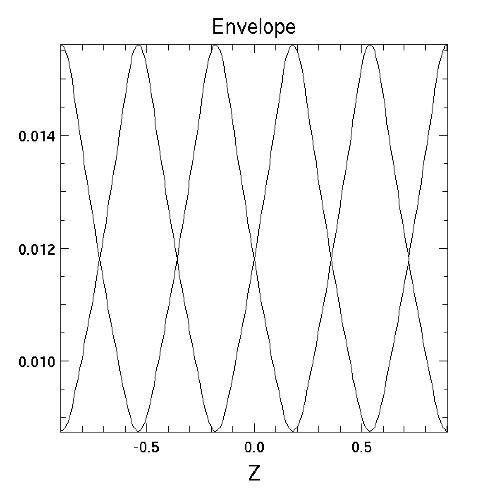
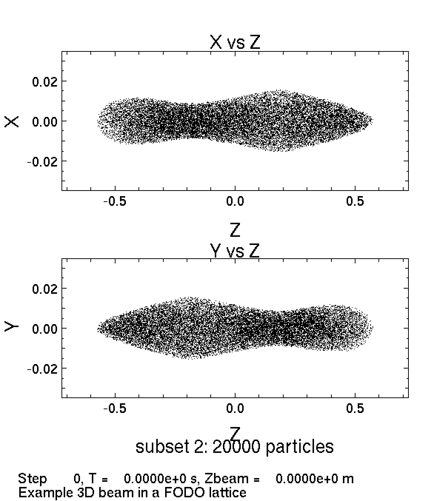
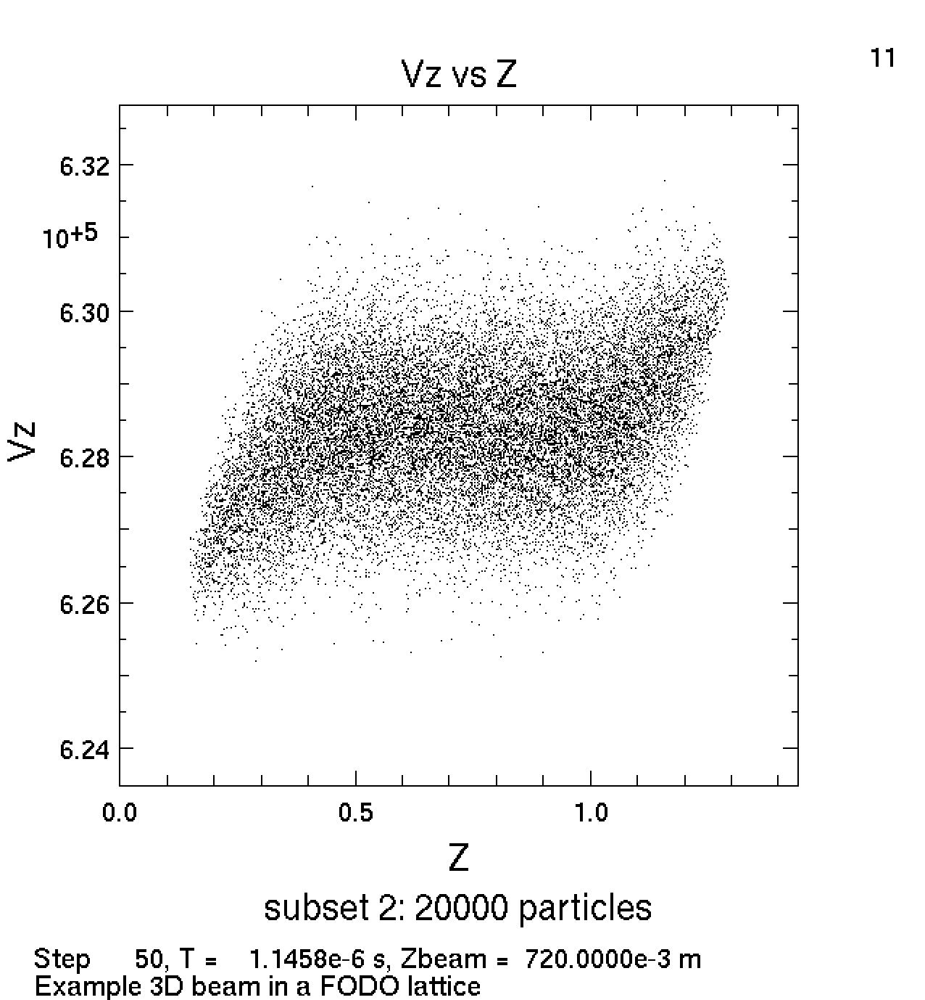

This week we looked at an example simulation of a FODO lattice written by David P. Grote, this simulation is contained in the file FODO3d.py, a copy of which has been added to this repository.

We read this script and tried to understand all the commands. Then we thought we would try to edit this code to simulate the FODO lattices in a different particle accelerator: the Large Hadron Collider (LHC). This collider was chosen because it is easy to find the parameters for this accelerator, (i.e. just do a Google search for "LHC design parameters" and you find the information you need). We have attempted to do this edited simulation in the file LHC.py, which has also been uploaded to this repository.

The results of these two scripts are shown below. The images on the left are the ones produced by the example FODO3d.py, and the images on the right are the ones produced by LHC.py. We are still trying to figure out how to get our simulation to work properly like the example.

 

 

 

 

 

 

 

 

 

 

 

 

 

 
